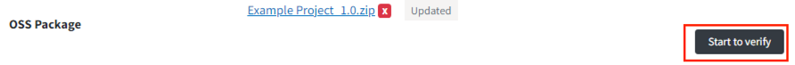
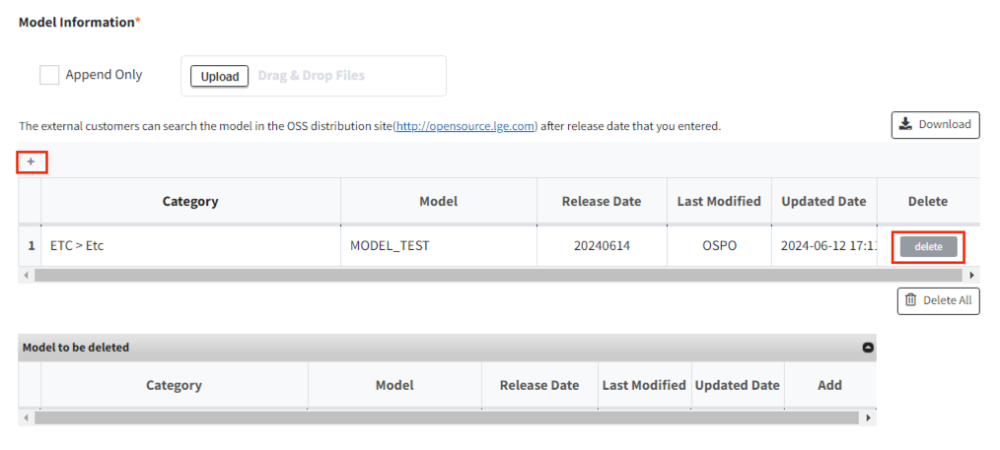
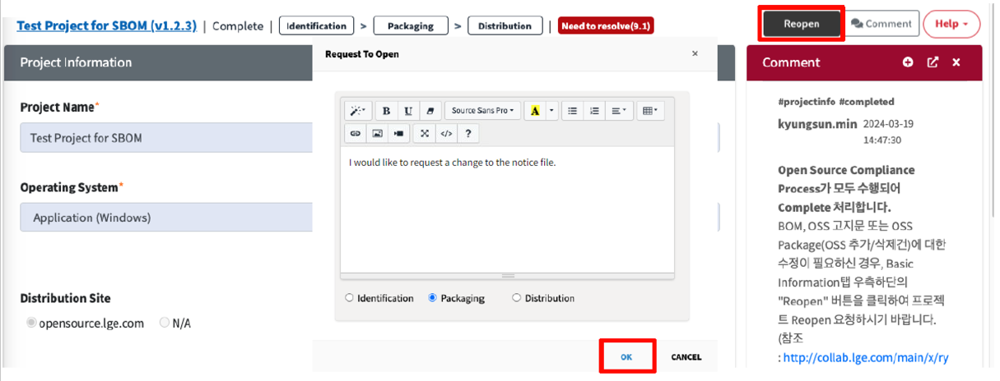
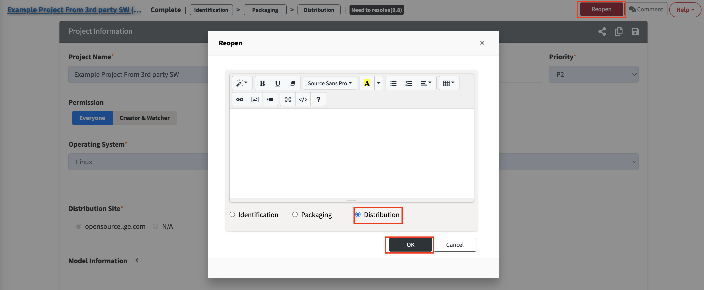

# [Enterprise Only] Distribution Information Update
- Distribution is an Enterprise-only feature.  
- Use this when modifications are needed for a project distributed on the [LG Open Source site](http://opensource.lge.com/).  

## Description Update    
{: .left-bar-title }  
1. Go to the Distribution tab.  
2. Edit the Description as desired and click the Save button ({: width="10px" height="15px"}).  
   {: width="600px" height="70px" .styled-image }  
3. In the Distribution Information (To be Updated) screen, check the updated information and click the "Distribute" button.  
   {: .styled-image }  
     

## OSS Package Update  
{: .left-bar-title }  
This guide is used when you need to make minor changes to a completed OSS package distribution (e.g., supplementing the README file).  
1. Go to the Distribution tab.  
2. Click the 'X' button to the right of the Package File you want to edit.  
   {: .styled-image }  
3. Click the Upload button to upload the updated OSS Package file. Once 'Updated' appears and the upload is confirmed, click the Start to Verify button.  
   {: .styled-image }  
4. If the verification is successful, the button will change to Completed as shown below.  
   {: .styled-image }  
   - If verification fails, a popup will appear asking if you want to retry.  
   - If it continues to fail, check whether the uploaded file matches the Path information set in the Packaging tab.  
5. Click the Save button ({: width="10px" height="15px"}) in the Distribution tab.  
   In the Distribution Information (To be Updated) screen, check the updated information and click the "Distribute" button.  
   {: width="600px" height="250px" .styled-image }  

     

## Model Information Update  
{: .left-bar-title }  
1. Go to the Distribution tab.  
2. Use the add/delete buttons in the Model Information section to modify the model information.    
   {: width="600px" height="350px" .styled-image }  
3. Click the Save button ({: width="10px" height="15px"}) in the Distribution tab.  
   After verifying the updated information on the Distribution Information (To be updated) screen, click the "Distribute" button.    
   {: width="600px" height="300px" .styled-image }  

     

## OSS Notice Update
{: .left-bar-title }  
To update the notice, **you must re-execute the Packaging step**.  
1. In the Project Information screen, click the "Reopen" button.  
2. In the Reopen popup, select "Packaging", write the reason for the request, and click OK.  
   {: width="700px" height="300px" .styled-image }  
3. Once approved by a reviewer, go to the Packaging tab, modify the notice with the required information, and request a review.  
4. After the Packaging step is completed, proceed with Distribution again.  

     

## Cancel Distribution  
{: .left-bar-title }  
To cancel the distribution, proceed as follows:  
1. In the Project Information screen of a completed project, click the "Reopen" button.  
2. In the Reopen popup, select "Distribution", write the reason for rejection, and click OK.  
   {: width="700px" height="400px" .styled-image }  
3. Once approved by a reviewer, the Distribution step will be canceled.
