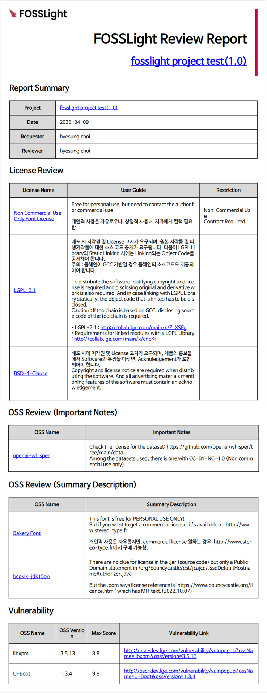
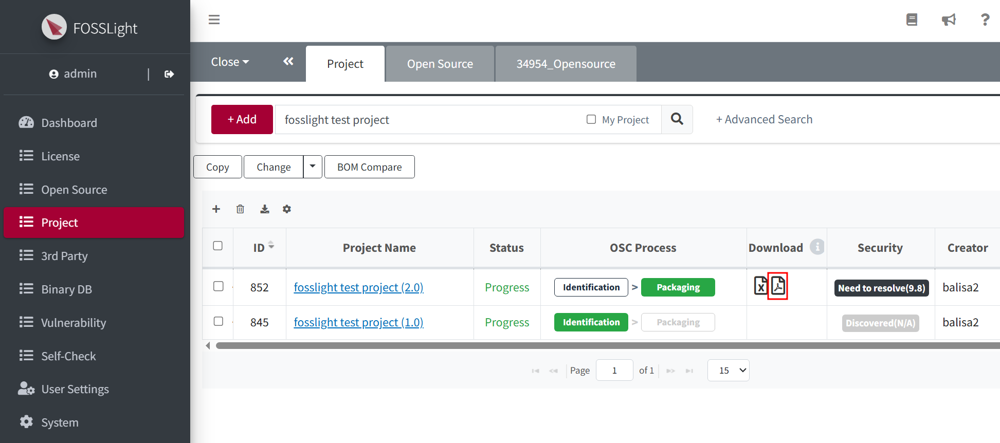

# Review Report  
The Review Report is issued based on the BOM details upon confirmation of the project's identification.

## Review Report Details  
{: .left-bar-title}  
{: .styled-image width="70%" }

### Title  
{: .specific-title }  
- Project Name (Version)  
- Project share URL link

### Report Summary  
{: .specific-title }  
- The Review Report includes the Project Name (Version), Date, Requestor, and Reviewer information.

### License Review  
{: .specific-title }  
- The Review Report includes the License Name, User Guide, and Restriction information.

### OSS Review (Important Notes)  
{: .specific-title }  
- The Review Report includes the OSS Name and Important Notes.

### OSS Review (Summary Description)  
{: .specific-title }  
- The Review Report includes the OSS Name and Summary Description.

### Vulnerability Review  
{: .specific-title }  
- The Review Report includes the OSS Name, OSS Version, Max Score, and Vulnerability Link.

## How to Access the Review Report  
{: .left-bar-title}

### Project List  
{: .specific-title }  
- The Review Report can be downloaded from the Project List.  
{: .styled-image width="70%" }

### Email Delivery  
{: .specific-title }  
- The report is provided as an email attachment once the project’s identification has been confirmed.

## Conditions for Review Report Generation  
{: .left-bar-title}  
Based on the BOM tab, the Review Report is generated if there is at least one applicable item in OSS Review (Summary Description), OSS Review (Important Notes), License Review, or Vulnerability Review.

- OSS Review (Summary Description)  
    - OSS with Summary Description.  
- OSS Review (Important Notes)  
    - OSS with Important Notes. 
- License Review  
    - The License Review is included if the project's **Distribution Type** is not 'Network service only', the Source Code Disclosure Scope is not 'None', and User Guide is provided.
    - If there are any Restrictions.  
- Vulnerability Review  
    - Items with Max Score equal to or greater than the value set by the admin are included.
