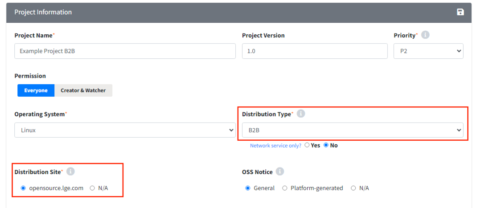
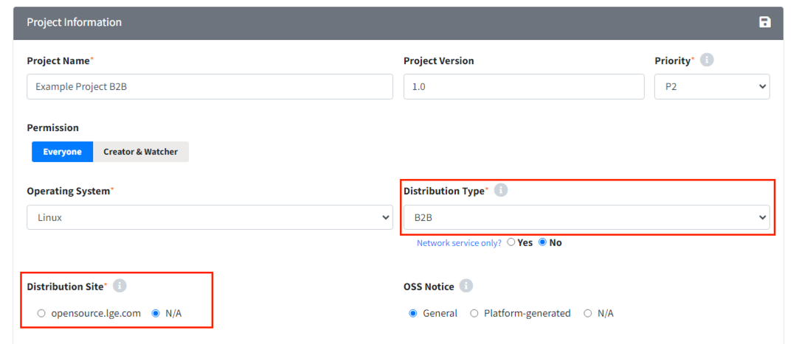
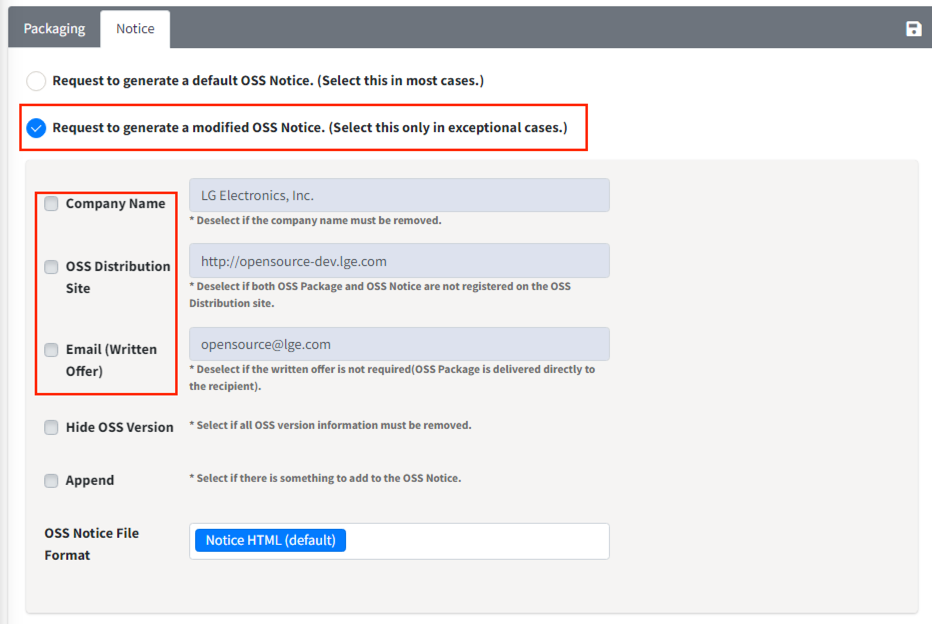

# B2B Model Project

When conducting a B2B project, follow these steps to create the project:

1. Select the Distribution Type as B2B.
2. Choose the Distribution Site according to the notice format required by the customer.

## If the product is distributed under our company name but delivered to the customer

In this case, you deliver the packaging files and notices to the customer, 
and upon the customer's request, post the information on the LG Open Source site. 
Proceed to the Distribution stage as with a general project to ensure the notice is posted on the LG Open Source site. 
Select the options as follows when creating the project:
{: width="80%"}
- Distribution Type: B2B
- Distribution Site: opensource.lge.com

## If the product is distributed under the customer's name and the notice and packaging files are delivered to the customer

In this case, the packaging files and notices should not be posted on the LG Open Source site.
Therefore, the Distribution stage does not proceed, and the OSC Process is completed at the Packaging stage. 
Additionally, remove the LG Electronics name, LG Open Source site name, and written offer email from the notice.

- Select the options as follows when creating the project:  
  {: width="80%"}
  - Distribution Type: B2B
  - Distribution Site: N/A

- Enter the following information at the Packaging stage:  
  {: width="80%"}
  - Select the request to generate a modified OSS Notice.
  - Deselect Company Name, OSS Distribution Site, and Email (Written Offer) to ensure they are not included.

