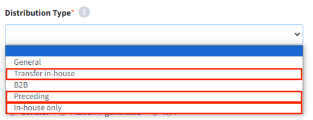

# Internal Transfer / Preceding Development / Internal Use Project

For internal transfer, preceding development, or internal use,
the OSC Process is completed without distribution and notice issuance.
If open source with disclosure obligations is used, the process is continued to the **Packaging stage**.
If no open source with disclosure obligations is used, the process is completed at the **Identification stage**.
{: width="50%"}

- Internal Transfer: When you need to deliver the list of open sources and packaging files used to another business unit, 
  select the Distribution Type as Transfer-in-house.
- Preceding Development: Select the Distribution Type as Preceding.
- Internal Use: Select the Distribution Type as In-house Only.

