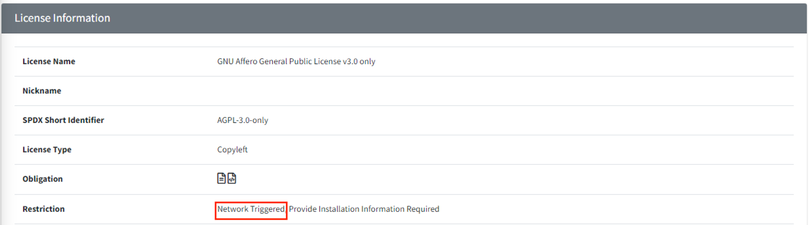

# Network Service Distribution Project

For projects that provide only network services, if no open source under a license that considers providing services 
over a network as distribution is used, OSC process is completed at the **Identification stage**. 
However, if such a license is used, OSC Process is continued to the **Distribution stage**.

For network service projects, select the Distribution Type options as follows:  
{: width="80%"}
- Network service only: Click "Yes" for the Network service only item.
- Drop-down box: Select according to the distribution target of the current project.

**Note**
> You can check license restrictions by searching for Restriction (Network Triggered) in the Identification tab or License menu.  
> **Example: AGPL-3.0**  
> {: width="80%"}

