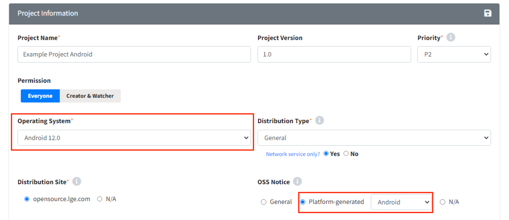
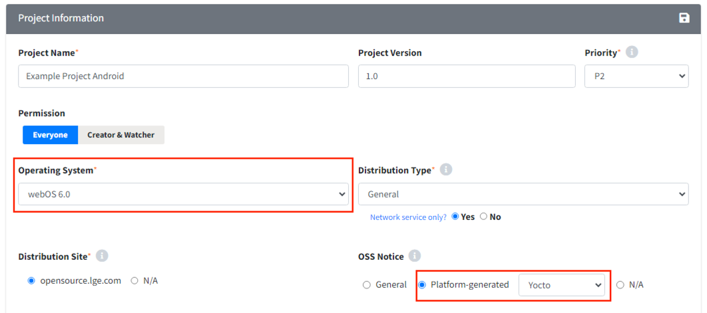

# Android / Yocto Platform Project

**Note**
> Android / Yocto is an LGE only feature.  

When the platform itself generates the notice, you need to create a project to review the platform-generated notice.
Currently, FOSSLight Hub supports Android and Yocto. To create a project for this, select the appropriate Operating System 
according to the OS and choose OSS Notice as Platform-generated.

## Android Model
{: width="80%"}
- Operating System: Select Android (platform version).
- OSS Notice: Select Platform-generated (Android).

## Yocto Model
{: width="80%"}
- Operating System: Select webOS (platform version).
- OSS Notice: Select Platform-generated (Yocto).

