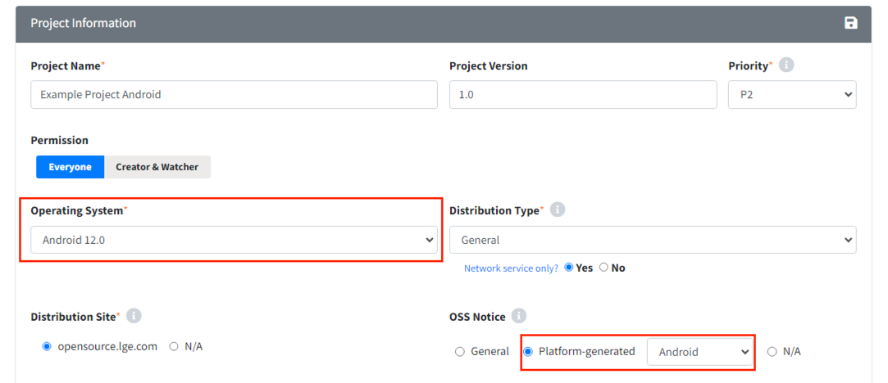

# Tips: Use Case
You can check how to create projects for each use case.  
  

## Derived Model Project  
{: .left-bar-title }  
For derivative model projects that use similar software to an existing model,  
you can efficiently carry out the OSC Process by [copying the completed project](https://fosslight.org/hub-guide-en/tips/2_project/2_using_project_info/#project-copy) of the previous model.  

### Extending the Base Model with Additional Open Source   
{: .specific-title }  
- When copying the project, select **Identification Progress** to copy the Open Source list from the base model project. Then, enter the additional Open Source in the Identification tab.  

### New Project with the Same OSS List as Existing Project   
{: .specific-title }  
You can use [SBOM Compare](https://fosslight.org/hub-guide-en/tips/2_project/2_using_project_info/#sbom-compare) to check whether the final OSS list is the same. 
- **When both OSS List and source code to be disclosed are the same**  
  - After copying the project with Packaging Confirm, perform the Distribution or add Models in the Distribution of the existing project.     
- **When OSS List is the same but source code to be disclosed is different**  
  - This applies when the changes are minor, such as modifying the README or Notice file of the OSS Package.    
  - When [Project Copy](https://fosslight.org/hub-guide/tips/2_project/2_using_project_info/#project-%EB%B3%B5%EC%82%AC) is performed, select the **Identification Confirm** step, and then perform Packaging and Distribution using the modified OSS Package.  
     

## B2B Model Project  
{: .left-bar-title }  
- For B2B projects, select **'B2B'** in Project > Project Information > Distribution Type.  
- Select the appropriate Distribution Site according to the format of OSS Notice required by the customer. 
  {: .styled-image } 
   
### When the Product is Distributed Under LG Name to the Customer  
{: .specific-title }  
When OSS Package and OSS Notice are delivered to the customer, and at the customer's request, the files are posted on the LG Open Source site.  
- Project creation options  
    - Distribution Type : B2B   
    - Distribution Site : opensource.lge.com  
- OSC Process  
    - Follow the same process as a general project up to the Distribution stage, and post OSS Notice on the LG Open Source site.   

### When the Product is Distributed Under the Customer's Name  
{: .specific-title }      
When OSS Package and OSS Notice are delivered to the customer, but at the customer's request, the files must not be posted on the LG Open Source site.  
- Project creation options    
  - Distribution Type : B2B
  - Distribution Site : N/A  
- OSC Process  
    - Do not carry out the Distribution stage; complete the OSC Process at the Packaging stage.  
    - Required changes in Packaging stage (Notice)  
        {: .styled-image }  
        - Select "Modified OSS Notice issuance request"    
        - Deselect Company Name, OSS Distribution Site, and Email (Written Offer), that is, remove LG-related information.      

   

## Internal Transfer / Preceding Development / Internal Use Project  
{: .left-bar-title }  
For Internal Transfer / Preceding Development / Internal Use Project, the OSC Process is completed without distribution or OSS Notice issuance.  
- Project creation options  
    - Distribution Type  
    {: .styled-image }  
        - Transfer-in-house (Internal Transfer) : When OSS list and OSS package must be delivered to other department  
        - Preceding (Preceding Development) : For early-stage development where distribution may occur later  
        - In-house only (In-house Use) : For use strictly within the company  
    - OSS Notice
        - When the distribution type corresponds to the condition described above, the OSS Notice is automatically set to N/A. 	If OSS Notice is needed, select the OSS Notice option manually.  
- OSC Process  
    - If OSS **with** source code disclosure obligations is used  
        - Carry out up to the **Packaging stage**.  
    - If OSS **without** source code disclosure obligations is used  
        - Carry out up to the **Identification stage**.  

   

## Project Distributed via Network Services  
{: .left-bar-title }  
It refers to the development of software that provides functions or data to external devices, applications, or users through Network Services.   
- Project creation options  
    - Distribution Type : Select based on the project's distribution target.  
    - Network service only? : Yes  
    {: .styled-image }  
- OSC Process    
    - If OSS with **Network Triggered license** is used : Proceed up to the **Distribution stage**.   
    - If OSS with **Network Triggered license** is not used : Proceed up to the **Identification stage**.   
- How to check license restrictions 
    - Access the Restriction column in Identification > SBOM, or search in the License menu to check **Restriction (Network Triggered)**.
    **Example: AGPL-3.0:**  
    {: .styled-image } 

   

## 3rd Party Only Project     
{: .left-bar-title }     
For projects consisting only of software received from a 3rd party, you can carry out the OSC Process by loading only the 3rd party tab in the Project.    
1. Create a 3rd Party Software and complete the review. (Reference: [3rd Party Software Creation Guide](../../menu/5_third-party.md))  
2. Create a project for issuing OSS Notice  
    - In the reviewed 3rd Party Software, click **Create Project for OSS Notice** button.  
    {: .styled-image }   
3. Enter project information  
    - In the New Project window, enter project information and click Save.  
    - In Additional Information, you can check the message that 3rd party SW information was imported.  
    {: .styled-image } 
4. Check the created project  
    - Check the 3rd party tab of the newly created project.  
    - You will see that the 3rd Party Software from stage 1 has been loaded.  
    - The project is created in **Confirm status at the Identification stage**, so carry out the Packaging step subsequently.  
    {: .styled-image } 

     

## (Enterprise Only) Android & Yocto Platform Projects  
{: .left-bar-title }  
When the platform itself generates OSS Notice, you need to create a project for reviewing the platform-generated OSS Notice.
- Fosslight Hub supported platforms : Android, Yocto    
- Project creation options  
    - **Android Model**  
        - Operating System : Select Android (platform version)  
        - OSS Notice : Select Platform-generated (Android)  
        {: .styled-image }
    - **Yocto Model**  
        - Operating System : Select webOS (platform version)  
        - OSS Notice : Select Platform-generated (Yocto)  
        {: .styled-image }  
