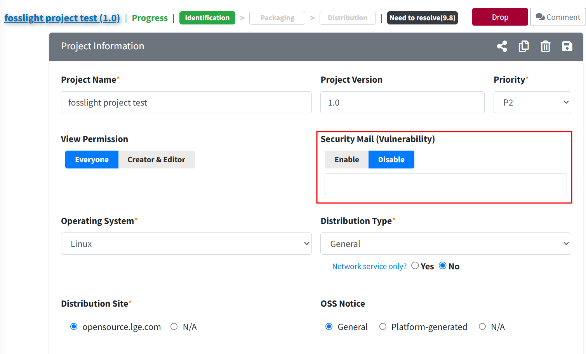
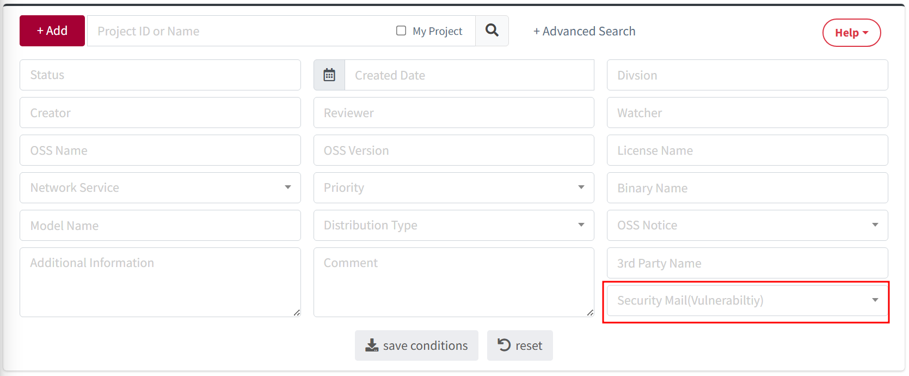

# Security Mail(Vulnearbility)

You can enable or disable the receipt of Security Mail (Vulnerability).  

### Security Mail(Vulnearbility) Setting
{: .specific-title}
- If you set Project Information > Security Mail (Vulnerability) to **Disable**, vulnerability emails for that project will no longer be sent.  
- If set to **Disable**, a reason must be provided.  
{: .styled-image} 

### Search for Security Mail(Vulnearbility) Setting
{: .specific-title}
 - You can search for the Setting value (Enable or Disable) of Security Mail (Vulnerability) in the Project List.  
{: .styled-image} 

