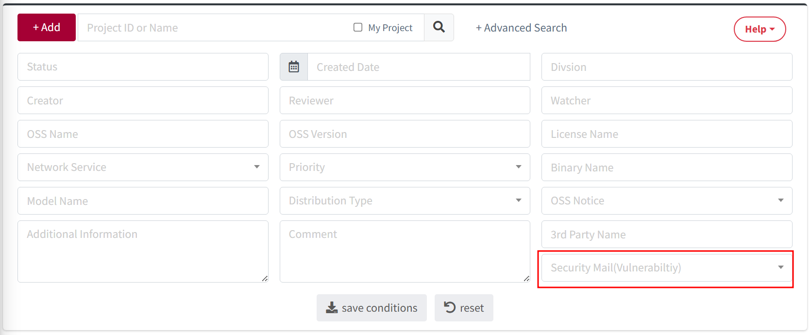

# Tips: Vulnerability 
It provides information on collecting vulnerability data, notifications, and how to display scores.
    

## Vulnerability Data Collection  
{: .left-bar-title }  
- Vulnerability data is downloaded daily from the [NVD Data Feed](https://nvd.nist.gov/vuln/data-feeds) and stored in the FOSSLight Hub.
- The Vulnerability Score in FOSSLight Hub is primarily based on the CVSS v4.0 Base Score. It is collected according to the following priority order.  
    1. CVSS v4.0
    2. CVSS v3.1
    3. CVSS v3.0
    4. CVSS v2.0  
     

## Vulnerability Notification  
{: .left-bar-title #project-vul-notice-en } 
- When the Identification step of Project is confirmed, if a CVE ID with a CVSS score of 7.0 or higher is found in any OSS included in the BOM, or if the maximum CVSS score of an OSS changes from 7.0 or higher to below 7.0, a Vulnerability Score Change Notification email will be sent.  
    - Recipients of the notification email :  Project's Creator, Users with edit permissions, and Reviewer.  
    - If you no longer wish to receive notification emails, you can change the [Security Mail (Vulnerability) setting to Disable](#security-mail-en) in Project Information.
     

## Vulnerability Score Display Method  
{: .left-bar-title }  
- In **Project**, **3rd Party**, or **Self-Check**, if there is a Vulnerability with the same OSS Name/Nickname and Version entered by the user, the Max Score of that OSS will be displayed.  
    - If there is a Vulnerability for the OSS Version entered by the user, the Max Score of that Vulnerability will be displayed.
    - If there is no Vulnerability for the OSS Version entered by the user, it will not be displayed as there is no value.
    - If the user leaves the OSS Version blank, the Max Score among all Versions of that OSS will be displayed.
    - If the OSS Name is '-', no Vulnerability will be displayed.  
   

## Security Mail(Vulnerability)  
{: .left-bar-title #security-mail-en }
You can **enable or disable** the [Project Vulnerability Notification](#project-vul-notice-en) email.  

### Security Mail (Vulnerability) Settings
{: .specific-title}
- If you set Security Mail (Vulnerability) in Project Information to **Disable**, no further Vulnerability emails will be sent for that Project.
- A reason must be provided when setting it to Disable.  
{: .styled-image} 

### Searching Security Mail (Vulnerability) Settings 
{: .specific-title}
 - You can search for the Security Mail (Vulnerability) setting value (Enable or Disable) in the Project List.  
{: .styled-image}