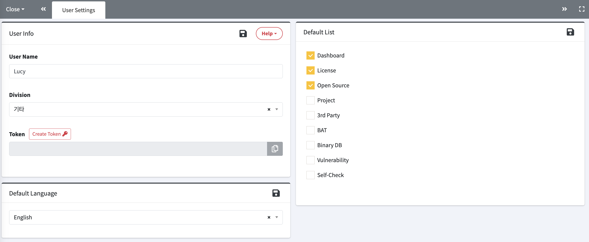

# User Settings
You can view and update your personal settings after logging in.  
 

1. **User Info**
    - User Name and Division can be modified. The configured Division will be used as the default value when creating a project in the 'Project' and '3rd Party' menus.  
    - Password : To change your password, check the box on the left and enter a new password.   
    - Token : You can view the issued token information.
2. **Default Language**
    - You can select a default language between Korean and English.
3. **Default List**
    - You can select the menu that will be displayed by default in the left navigator area after login.  