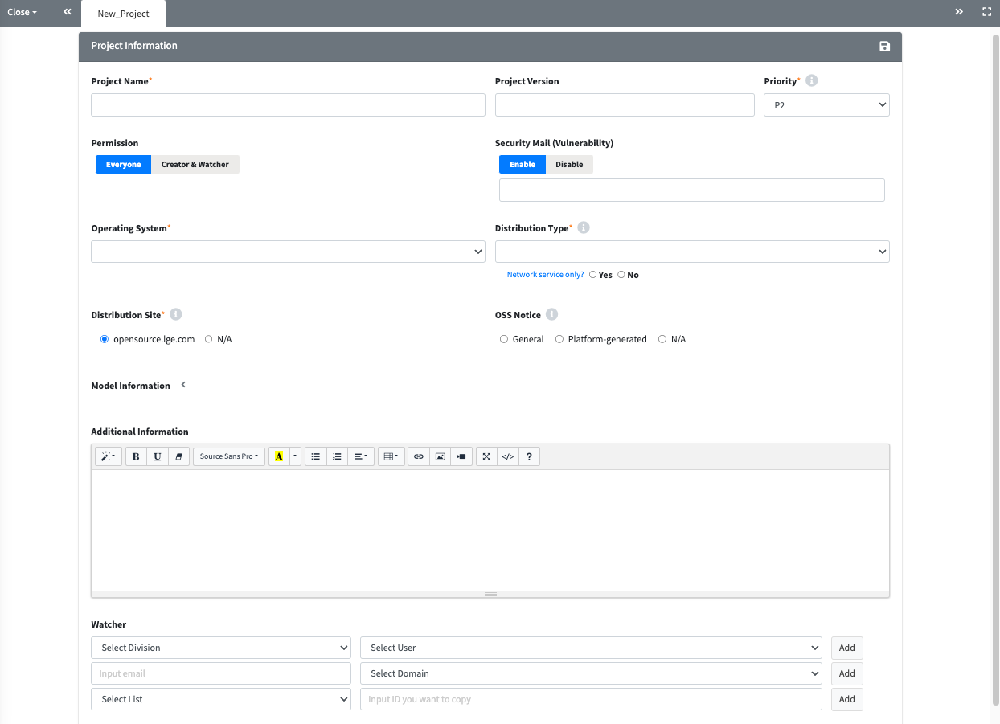

# Project Tutorial
```note
Create a project and perform the OSC (Open Source Compliance) process.
1. Project creation
2. Identification
3. Packaging 
4. Download OSS Notice
```
<iframe width="560" height="315" src="https://www.youtube.com/embed/IUrQyj3s-Ps" title="FOSSLight Hub - 프로젝트 생성" frameborder="0" allow="accelerometer; autoplay; clipboard-write; encrypted-media; gyroscope; picture-in-picture" allowfullscreen></iframe>

## Project Process

### 1. Create a Project
**Create a project for the software being distributed.**

1. Click the **Add** button in the **Project List**.


2. Enter the project-related information in the **New_Project** tab.
   

3. Click the **Save**() button at the top right corner to finalize your entries.  
<br>

#### Project Information
This page is for entering basic information about the project.

- **Project Name**: Enter the project name.
    - If the model name is the same as the project name, input the model name (English is recommended).
- **Project Version**: Enter the project version. Leave blank if not applicable.
- **Permission**: Set project visibility. Choose 'Creator & Watcher' for limited visibility, or 'Everyone' for full visibility.
- **Operating System**: Select the OS or manually input it.
- **Security Mail (Vulnerability)**: Indicates whether to receive Vulnerability emails for the project.
  - By default, Enable is selected.
  - If Disable is selected, Vulnerability emails for the project will no longer be received.
  - When changing to Disable, the reason for disabling must be entered.
- **Distribution Type**: Select the distribution type
    - **General Model**: For distributing general model, software, or applications.
    - **Transfer in-house**: For internal company transfers.
    - **B2B**: When providing to another company.
    - **Preceding Software / In-house only**: For software in early development or not intended for external distribution.
- **Network Service only?**: Select 'Yes' if the project is a network service (e.g., Web Service).
- **Distribution Site**: Select the OSS distribution site where the OSS notice will be registered (e.g., LG Open Source site).
    - **[opensource.lge.com](http://opensource.lge.com/)**: Default distribution site for most cases.
        - <U>For network service projects, also select "opensource.lge.com".</U>
    - **N/A**: Select this option if the OSS notice cannot be registered on a site (e.g., source code is delivered directly to a third party).
- **OSS Notice**: Select the appropriate OSS notice format.
    - **General**: For a standard OSS notice issuance.
    - **Platform-generated**: Choose this if the OSS notice is generated by a platform (e.g., Android, Yocto) and embedded in the product.
    - **N/A**: Select this if no OSS notice is required.- **Priority**: Set the priority level for OSS notice requests (P0, P1, P2).
- **Priority**: Select the priority level for the OSS notice issuance request.  
    - The default is P2, and you can choose according to urgency (P0 > P1 > P2).  
    - Frequent selection of P0 may lead to the organization being subject to OSC process checks.
- **Model Information**: Enter the model information corresponding to the project, including the release date.
- **Additional Information**: Enter any supplementary information required for compliance.
- **Watcher**: Register users who want to share the project's information and status.  
    - Users registered as Watchers have the same viewing and editing rights as the Creator, and they will receive project-related emails from the system.  
    - However, accounts added with AD ID that are not registered in the FOSSLight Hub will only receive the initial account registration email, not project-related emails.
- **Comment**: Enter any comments or notes related to the project.


#### Share, Copy, Delete, Save, and etc.
- **Share**: You can share the project via the generated URL.  
- **Copy**: Creates a new project by duplicating the existing one.  
- **Delete**: Deletes the project.  
- **Save**: Click to save any modifications made to the basic information.  
- **Drop**: Changes the project's status to "Drop"; click the Open button to continue processing.  
- **Open**: Appears when the status is "Drop"; clicking it changes the status to "Progress."  
- **Reopen**: Changes the status of a "Complete" project back to "Progress" for reprocessing.  
- **(Admin Only)**:  
  - Complete: Changes the status of fully completed projects.  
  - Open: Changes the status to "Progress" for projects with "Complete" or "Drop" statuses.  


### 2. Identification
**Write an analysis of the Open Source Software for the distributed project and receive a review from the OSPO.**

Click the Identification icon () in the OSC Process section of the Project List to enter.

**Identification Process for General Projects**
- Click the **Request** button on the **BOM** tab after filling out the **3rd Party, DEP, SRC,** and **BIN** tabs for a review request.  
    - **3rd Party**: Load the 3rd Party included in the project.  
    - **DEP**: Document the dependency analysis results.  
    - **SRC**: Document the source code analysis results.  
    - **BIN**: Document the binary analysis results.  
    - **BOM**: Compile the OSS list from other tabs and review warning messages before requesting a review.

**Identification Process for Android/Yocto Models**
- After filling out the **BIN(Android/Yocto)** tab, click the **Request** button to submit a review request.  
    - **BIN(Android/Yocto)**: Document the analysis results for the Android binary.

#### 2-1. 3rd Party Tab
<iframe width="560" height="315" src="https://www.youtube.com/embed/IIOsmWupkn4" title="3rd Party Software 등록" frameborder="0" allow="accelerometer; autoplay; clipboard-write; encrypted-media; gyroscope; picture-in-picture" allowfullscreen></iframe>


**3rd Party Tab Writing Process**  
- If the project includes 3rd Party Software: <U>Load the pre-reviewed 3rd Party → Save</U>  
- If the project does not include 3rd Party Software: <U>Check Not Applicable → Save</U>

**How to Load 3rd Party Software**
<iframe width="560" height="315" src="https://www.youtube.com/embed/KKcI48nCAqA" title="3rd Party SW 불러오기" frameborder="0" allow="accelerometer; autoplay; clipboard-write; encrypted-media; gyroscope; picture-in-picture" allowfullscreen></iframe>

You can select from the following methods to import 3rd Party Software information.  
(💁 You can import multiple 3rd Parties.)
- **3rd Party Search**  
    1. Search for reviewed 3rd Party Software in the 3rd Party List menu.  
    2. Select the 3rd Party to load from the search results.  
    3. Click the Load button to add the OSS list of the selected 3rd Party.  
    4. The loaded 3rd Party will be added to the Loaded List.  
    5. Verify the added OSS list.  
    6. Click the Save button to save the loaded items.

    Search for 3rd Party Software with a status of "confirm" in the 3rd Party List menu and load it.  
- Project Search: Load the 3rd Party tab from another project.


<iframe width="560" height="315" src="https://www.youtube.com/embed/iuHTSEgqMRc" title="DEP / SRC/ BIN 탭 작성하기" frameborder="0" allow="accelerometer; autoplay; clipboard-write; encrypted-media; gyroscope; picture-in-picture" allowfullscreen></iframe>

#### 2-2. DEP Tab

**DEP Tab Writing Process**  
- If OSS is included via a package manager: <U>Document the OSS information for each dependency → Save</U>  
- If OSS is not included via a package manager: <U>Check Not Applicable → Save</U>

**How to Document OSS Information for Each Dependency**  
- **Manually Enter in OSS Table**  
    - Click the + button in the top left corner of the OSS Table to input the OSS information.
- **How to Bulk Load OSS Information**  
    1. Upload the FOSSLight Report containing the OSS List in the "Upload Analysis Result" section.  
        - You can download the compatible FOSSLight Report format by clicking the "Export" button in the top right corner.  
    2. Project Search: Load the DEP tab from another project.
- **How to Automatically Fill Using a Scanner**
    - A report can be automatically generated with OSS information filled in through the FOSSLight Dependency Scanner.

#### 2-3. SRC Tab

**SRC Tab Writing Process**  
- If OSS is included per source code: <U>Document OSS information for each source code → Save</U>  
- If the source code is not subject to OSS analysis: <U>Check Not Applicable → Save</U>

**How to Document OSS Information by Source Code**  
- **Manually Enter in OSS Table**  
    - Click the + button in the top left corner of the OSS Table to input the OSS information.
- **How to Bulk Load OSS Information**  
    1. Upload the FOSSLight Report containing the OSS List in the "Upload Analysis Result" section.  
        - You can download the compatible FOSSLight Report format by clicking the "Export" button in the top right corner.  
    2. **Project Search**: Load the SRC tab from another project.
 
#### 2-4. BIN Tab


**BIN Tab Writing Process**  
- If binaries are included: <U>Document OSS information for each binary → Save</U>  
- If binaries are not included: <U>Check Not Applicable → Save</U>

**How to Document OSS Information by Binary**  
- **Manually Enter in OSS Table**  
    - Click the + button in the top left corner of the OSS Table to input the OSS information.  
- **How to Bulk Load OSS Information**  
    1. Upload the FOSSLight Report containing the OSS List in the "Upload Analysis Result" section.  
        - You can download the compatible FOSSLight Report format by clicking the "Export" button in the top right corner.  
    2. **Project Search**: Load the BIN tab from another project.


#### 2-5. BOM Tab
<iframe width="560" height="315" src="https://www.youtube.com/embed/ErqmgN-YgD0" title="BOM 탭(SBOM 다운로드)" frameborder="0" allow="accelerometer; autoplay; clipboard-write; encrypted-media; gyroscope; picture-in-picture" allowfullscreen></iframe>


Collect the OSS lists written in the 3rd Party, DEP, SRC, and BIN tabs and submit a review request.


##### How to Request a Review
1. Click the **Save** button.  
   - This will consolidate the OSS lists from the 3rd Party, DEP, SRC, and BIN tabs.  
2. Review the issues highlighted in the [Warning message](#warning).  
3. Click the Request Review button to submit your review request.  
   - Note that if there are any red Warning Messages, you cannot submit the review request.
  
##### (Admin only) Review Process
1. Click the Review Start button in the upper right corner of the BOM tab.
2. Review the issues highlighted in the [Warning message](#warning).
3. After clicking **Save**, click Confirm to activate the Packaging tab.  
   - If a re-confirmation from the Creator is needed, click **Reject** to change the status back to Progress.

### 3. Packaging
```note
- In the Packaging stage, OSS that requires the disclosure of Source Code is compiled into an OSS Package and registered in the FOSSLight Hub.
- The OSS notice is automatically generated when the Packaging stage is confirmed. If any modifications are needed, changes can be made in the Notice tab.
- Access this stage by clicking the button in the Packaging column of the Project List.
```
<iframe width="560" height="315" src="https://www.youtube.com/embed/H4CPBzUOn7M" title="OSS Package & OSS Notice 생성" frameborder="0" allow="accelerometer; autoplay; clipboard-write; encrypted-media; gyroscope; picture-in-picture" allowfullscreen></iframe>

#### 3-1. Packaging Tab

In the Packaging tab, the OSS Package file is uploaded and verified. 
(If no Open Source software requiring Source Code disclosure is used, this tab will be inactive.)
1. **OSS Package Upload**
   - Upload the Packaging file (compressed file) that consolidates the source code.
2. **Fill in the "Path of source code in the OSS Package" column.**
   - If there are many types of Open Source to disclose, download the Packaging OSS List file using the 'Export Path' button, fill in the paths, and then upload with the 'Upload Path' button.
   - You can save the entered path information with the 'Save' button.
   - Path information is case-sensitive, so please be careful when entering it.
3. **Click the 'Verify' button to perform the verification process.**
   - After verification, the number of files found in the OSS Package will be displayed in the File Count field. If any Open Source is not found, it will indicate "path not found."
   - You can review the README, File List, and Banned List found in the OSS Package:
     - **README**: The README file included in the OSS Package.
     - **File List**: A list of files in the OSS Package.
     - **Banned List**: A list of files that should not be disclosed, such as "Proprietary" or "Commercial."


#### 3-2. Notice Tab

**OSS Notice is automatically generated based on the Identification > BOM tab. At this time, you can modify the format or contents of the OSS Notice being issued.**

#### 3-3. Requesting Review
- Click the **Request Review** button at the top right of the Packaging tab to request a review.

#### 3-4. Review Process (Admin Only)
- Click the **Review Start** button at the top right of the Packaging tab.
- Click **Confirm** at the top right to confirm the Packaging, completing the OSC Process.
- For Projects where Packaging is confirmed, you can download the issued OSS Notice from the Project List.
    - If re-confirmation is needed from the Creator, click Reject to change the Status back to Progress

### 4. Distribution (Enterprise Only)
<iframe width="560" height="315" src="https://www.youtube.com/embed/skip2wLoD90" title="OSS Package & OSS Notice 배포" frameborder="0" allow="accelerometer; autoplay; clipboard-write; encrypted-media; gyroscope; picture-in-picture" allowfullscreen></iframe>

```note
When Distribution is performed, the OSS notice and OSS package are registered on the distribution site.
```
#### Distribution Sites
- **LG Electronics**: OSS notices and packages are registered on the LG Open Source site’s Product page ([https://opensource.lge.com/product](https://opensource.lge.com/product)).
- **Other Companies**: Registered on the distribution sites set by each respective company.

#### (Admin Only) Distribution Authority
- Distribution can only be performed by users with **Admin rights** since it involves public disclosures.
    - For **LG Electronics**, Admin accounts are granted only to OSC personnel within the division/research lab.
      If the Project Creator is not the OSC representative, please add the organization's OSC representative to the Project > Watcher section and request them to proceed with the Distribution stage.


## ⭐Tips for Project
### Check OSS Name Button (DEP, SRC, BIN Tab)
**Automatically changes to the OSS Name stored in the FOSSLight Hub based on the Download location written in the OSS Table.**
- For detailed guidance, please refer to [Tips > Common > Pre-Review](../tips/1_common/2_pre_review).
 
### <a name="comment"></a> Adding Comments
- You can leave a comment on the project and send that comment via email to the Reviewer, Watcher, and Creator.
- For detailed guidance, please refer to [Tips > Common > Comment](../tips/1_common/4_comment).


### <a name="warning"></a> OSS Table's Warning message 
- You can identify issues that need review through the Warning Message in the OSS Table.
- The meaning of each Warning Message can be found in [Tips > Common > Warning Message](../tips/1_common/5_warning_message).
