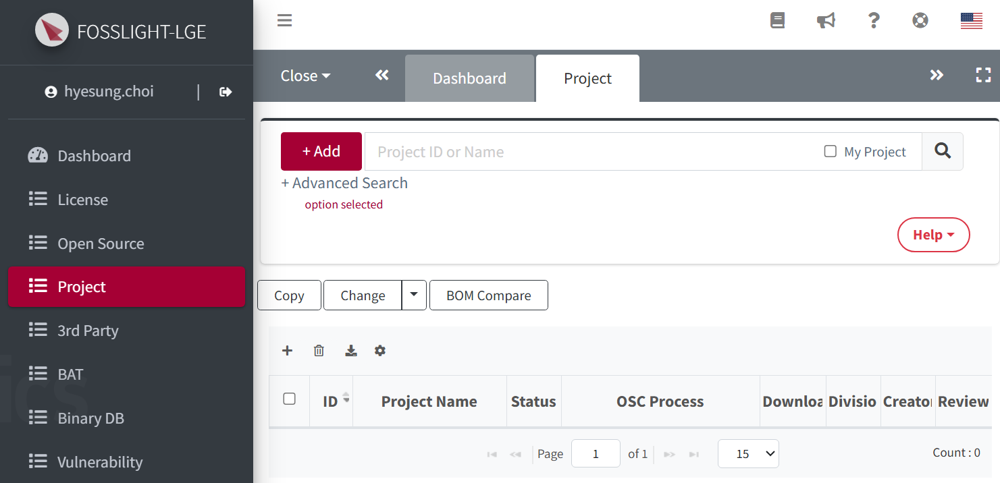

# Create a Project
Create a project for the software being distributed.

## YouTube Guide
{: .left-bar-title}  

<iframe src="https://www.youtube.com/embed/IUrQyj3s-Ps" title="FOSSLight Hub - 프로젝트 생성" frameborder="0" allow="accelerometer; autoplay; clipboard-write; encrypted-media; gyroscope; picture-in-picture" allowfullscreen></iframe>

   

## How to create a project 
{: .left-bar-title }

1. Click the **Add** button in the **Project List**.  
  

2. Enter the project-related information in the **New_Project** tab.
{: .styled-image}

3. Click the **Save**() button at the top right corner to finalize your entries.  
  

### Project Information
{: .specific-title}
This page is for entering basic information about the project.

<table>
    <thead>
        <tr>
            <th scope="col">Item</th>
            <th scope="col">Description</th>
        </tr>
    </thead>
    <tbody>
        <tr>
            <td><strong class="highlight_table">Project Name</strong></td>
            <td>Enter the project name.  
                <ul class="description-list">
                    <li>If the model name is the same as the project name, input the model name (English is recommended).</li>
                </ul>
            </td>   
        </tr>
        <tr>
            <td><strong class="highlight_table">Project Version</strong></td>
            <td>Enter the project version. 
                <ul class="description-list">
                    <li>Leave blank if not applicable.</li>
                </ul>
            </td>
        </tr>
        <tr>
            <td><strong class="highlight_table">Priority</strong></td>
            <td>Select the priority level for the OSS notice issuance request. 
                <ul class="description-list">
                    <li>The default is P2, and you can choose according to urgency (P0 > P1 > P2).</li>
                    <li>Frequent selection of P0 may lead to the organization being subject to OSC process assessments.</li>
                </ul>
            </td>
        </tr>
        <tr>
            <td><strong class="highlight_table">View Permission</strong></td>
            <td>Set project visibility. 
                <ul class="description-list">
                    <li>Choose 'Creator & Editor' for limited visibility, or 'Everyone' for full visibility.</li>
                </ul>
            </td>
        </tr>
        <tr>
            <td><strong class="highlight_table">Security Mail (Vulnerability)</strong></td>
            <td>Indicate whether to receive Vulnerability emails for the project. 
                <ul class="description-list">
                    <li>By default, 'Enable' is selected.</li>
                    <li>If 'Disable' is selected, Vulnerability emails for the project will no longer be received.</li>
                    <li>When changing to ‘Disable’, the reason for disabling must be entered.</li>
                </ul>
            </td>
        </tr>
        <tr>
            <td><strong class="highlight_table">Security Responsible Person</strong></td>
            <td>A specific security responsible person can be designated. 
                <ul class="description-list">
                    <li>Only users registered in FOSSLight Hub are eligible for designation.</li>
                    <li>The designated person is assigned as the Assignee for security-related Jira issues and receives related emails from FOSSLight Hub.</li>
                    <li>If no security responsible person is designated, the Creator of the issue is assigned by default.</li>
                </ul>
            </td>
        </tr>
        <tr>
            <td><strong class="highlight_table">Operating System</strong></td>
            <td>Select the operating system. 
                <ul class="description-list">
                    <li>If there are no available options, select 'Input Manually' and enter it.</li>
                </ul>
            </td>
        </tr>
        <tr>
            <td><strong class="highlight_table">Distribution Type</strong></td>
            <td>Select one of the following distribution types. 
                <ul class="description-list">
                    <li><strong>General Model</strong>: Distributing general model, software, or applications.</li>
                    <li><strong>Transfer in-house</strong>: Transferring to other organization within the company.</li>
                    <li><strong>B2B</strong>: Providing to another company.</li>
                    <li><strong>Preceding Software / In-house only</strong>: Preliminary development or not intended for external distribution.</li>
                    <li><strong>Self-Check</strong>: Intended for internal review and pre-verification, not for distribution.</li>
                </ul>
            </td>
        </tr>
        <tr>
            <td><strong class="highlight_table">Network Service only?</strong></td>
            <td>Select 'Yes' if the project is a network service (e.g., Web Service).</td>
        </tr>
        <tr>
            <td><strong class="highlight_table">Distribution Site</strong></td>
            <td>Select the OSS distribution site where the OSS notice will be registered. 
                <ul class="description-list">
                    <li><strong>[opensource.lge.com](http://opensource.lge.com/)</strong>: Default distribution site for most cases.</li>
                    <li><U>For network service projects, also select "opensource.lge.com".</U></li>
                    <li><strong>N/A</strong>: Select this option if the OSS notice cannot be registered on a site (e.g., source code is delivered directly to a third party).</li>
                </ul>
            </td>
        </tr>
        <tr>
            <td><strong class="highlight_table">OSS Notice</strong></td>
            <td>Select the appropriate OSS notice format. 
                <ul class="description-list">
                    <li><strong>General</strong>: FA standard OSS notice.</li>
                    <li><strong>Platform-generated</strong>: The OSS notice is generated by a platform (e.g., Android, Yocto) and embedded in the product.</li>
                    <li><strong>N/A</strong>: No OSS notice is required.</li>
                </ul>
            </td>
        </tr>
        <tr>
            <td><strong class="highlight_table">Model Information</strong></td>
            <td>Enter the model information corresponding to the project, including the release date.</td>
        </tr>
        <tr>
            <td><strong class="highlight_table">Additional Information</strong></td>
            <td>Enter any supplementary information required for compliance.</td>
        </tr>
        <tr>
            <td><strong class="highlight_table">Edit Permission</strong></td>
            <td>Add users who want to share the project's information and status. 
                <ul class="description-list">
                    <li>Users added as a Editor have the same viewing and editing permissions as the Creator, and receive project-related emails from the system.</li>
                    <li>However, accounts added with AD ID that are not registered in the FOSSLight Hub will only receive the initial account registration email, not project-related emails.</li>
                </ul>
            </td>
        </tr>
        <tr>
            <td><strong class="highlight_table">Comment</strong></td>
            <td>Enter any comments or notes related to the project.</td>
        </tr>
    </tbody>
</table>

#### Share, Copy, Delete, Save, and etc.
{: .specific-title}  
For more details, please refer to [Common Features of the Detail Screen](https://fosslight.org/hub-guide-en/tips/1_common/3_project_tab_bar).  
- **Share**(  ): Shares the project via the generated URL.  
- **Copy**(  ): Creates a new project by duplicating the existing one.  
- **Delete**(  ): Deletes the project.  
- **Save**(  ): To save any modifications, ‘Save’ button should be clicked.
- **Drop**: Changes the project's status to "Drop"; click the Open button to continue processing.  
- **Open**: Appears when the status is "Drop"; clicking it changes the status to "Progress."  
- **Reopen**: Changes the status of a "Complete" project back to "Progress" for reprocessing.  
- **(Admin Only)**:  
  - Complete: Changes the status of fully completed projects.  
  - Open: Changes the status to "Progress" for projects with "Complete" or "Drop" statuses. 