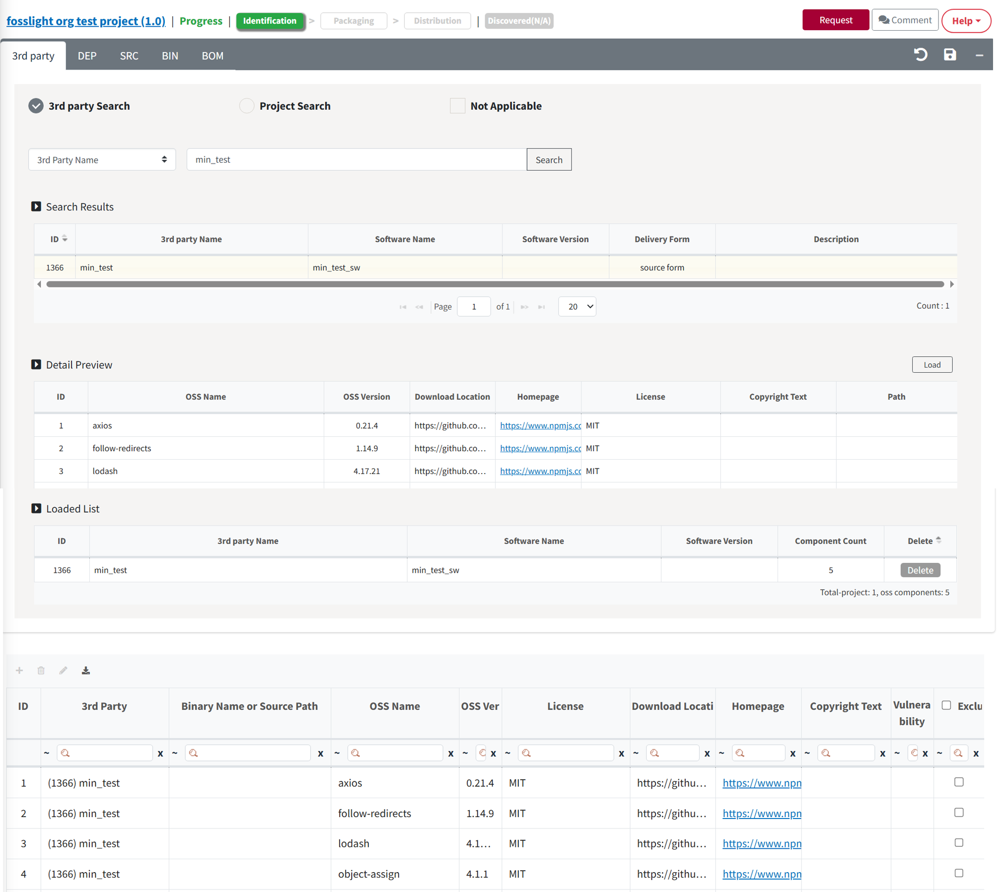

# 3rd Party Tab

Load the 3rd Party Project confirmed in the 3rd Party List menu.

<iframe src="https://www.youtube.com/embed/IIOsmWupkn4" title="3rd Party Software 등록" frameborder="0" allow="accelerometer; autoplay; clipboard-write; encrypted-media; gyroscope; picture-in-picture" allowfullscreen></iframe>

## 3rd Party Process
{: .left-bar-title }
- If 3rd Party Software is included: Load the 3rd party that has been reviewed in advance. → Save
- If 3rd Party Software is not included : Check "Not Applicable" → Save

## How to load the 3rd Party that has been reviewed**
{: .left-bar-title }

<iframe src="https://www.youtube.com/embed/KKcI48nCAqA" title="3rd Party SW 불러오기" frameborder="0" allow="accelerometer; autoplay; clipboard-write; encrypted-media; gyroscope; picture-in-picture" allowfullscreen></iframe>  

You can load 3rd Party Software by selecting one of the following methods. (💁 Multiple 3rd party projects can be loaded at once)

### 3rd Party Search
{: .specific-title} 
Load 3rd Party Software which status is confirmed.
{: .styled-image}

1. Search 3rd Party software reviewed in 3rd Party menu.
2. Select 3rd Party Software to retrieve from the list.
3. Click the Load button to add the OSS list of the 3rd Party that you selected.
4. Loaded 3rd Party is added to "Loaded List".
5. Check the list of OSS that you loaded.
6. Click the Save button.

### Project Search
{: .specific-title} 

1. Search for the Project to load.
2. Select the project to load from the search result.
3. Click the Load button to load the OSS list in the 3rd Party tab of the selected project
4. Loaded 3rd Party is added to "Loaded List".
5. Check the list of OSS that you loaded.
6. Click the Save button.
