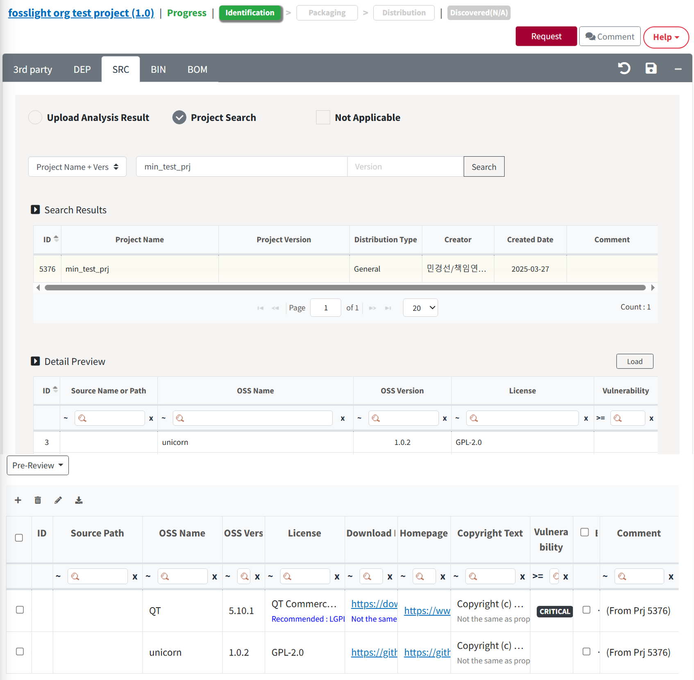

# SRC Tab

Fill in the result of Source Code Analysis.

## SRC Tab Process
{: .left-bar-title }
- For projects that perform Source Code Analysis : Fill in the result of Source Code Analysis. → [**Check Warning message**](https://fosslight.org/hub-guide-en/tips/1_common/5_warning_message) → Save
- For projects that do not perform Source Code Analysis : Check Not Applicable → Save  
    - Select only for Model/Software that does not perform Source Code Analysis. (ex - If only the binaries received from the 3rd party are installed and distributed on the product.)  

## How to fill in the result of Source Code Analysis
{: .left-bar-title }  
You can choose from the following methods to fill in the result of Source Code Analysis, which can be modified by referring to the [How to Use the OSS Table](https://fosslight.org/hub-guide-en/tips/1_common/1_oss_table).

### Fill in OSS List in the browser
{: .specific-title}  
- Click the + button at the top left of the OSS Table to fill in OSS information.   

### Upload Analysis Result 
{: .specific-title}
1. Select 'Upload Analysis Result'.  
2. Click Upload button and then upload FOSSLight Report file.  

3.  In the Select Sheet pop-up, select the sheet name in which the OSS list of the SRC analysis results is written.  

### Project Search 
{: .specific-title} 
1. Select 'Project Search'.  
2. Search project to load.  
3. After selecting the project to load SRC tab from the result, click Load button.  
4. Select one of the following buttons.  

    - Reset & Load : Initialize SRC tab and then load the SRC tab of the imported project to the OSS Table.  
    - Load & Append : Append SRC tab of the imported project to the OSS Table.  
    - Cancel  
5. The imported project is added to the "Loaded List".  
