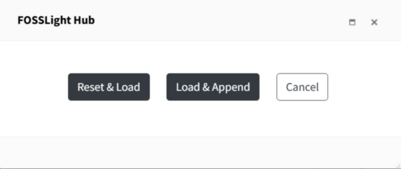

# BIN Tab

Fill in the result of Binary Analysis.

## BIN Tab Process
{: .left-bar-title }
- For projects that perform binary analysis: Fill in the result of binary analysis → [**Check Warning message**](https://fosslight.org/hub-guide-en/tips/1_common/5_warning_message) → Save
- For projects that do not perform binary analysis: Check Not Applicable → Save
    - Select only for project that does not perform binary analysis.

## How to fill in the result of Binary Analysis
{: .left-bar-title }
You can choose from the following methods to write the result of Binary Analysis, which can be modified by referring to the [How to Use the OSS Table](https://fosslight.org/hub-guide-en/tips/1_common/1_oss_table).

### Fill in OSS List in the browser
{: .specific-title}  
-  Click the + button at the top left of the OSS Table to fill in OSS information.   

### Upload Analysis Result 
{: .specific-title}
1. Select 'Upload Analysis Result'.  
2. Click Upload button and then upload FOSSLight Report file.  

3. In the Select Sheet pop-up, select the sheet name in which the OSS list of the Binary analysis results is written. 

### Project Search 
{: .specific-title} 
1. Select 'Project Search'.  
2. Search project to load.  
3. After selecting the project to load SRC tab from the result, click Load button.  
4. Select one of the following buttons  

    - Reset & Load : Initialize SRC tab and then load the SRC tab of the imported project to the OSS Table.   
    - Load & Append : Append SRC tab of the imported project to the OSS Table.  
    - Cancel 

5. The imported project is added to the "Loaded List".   

