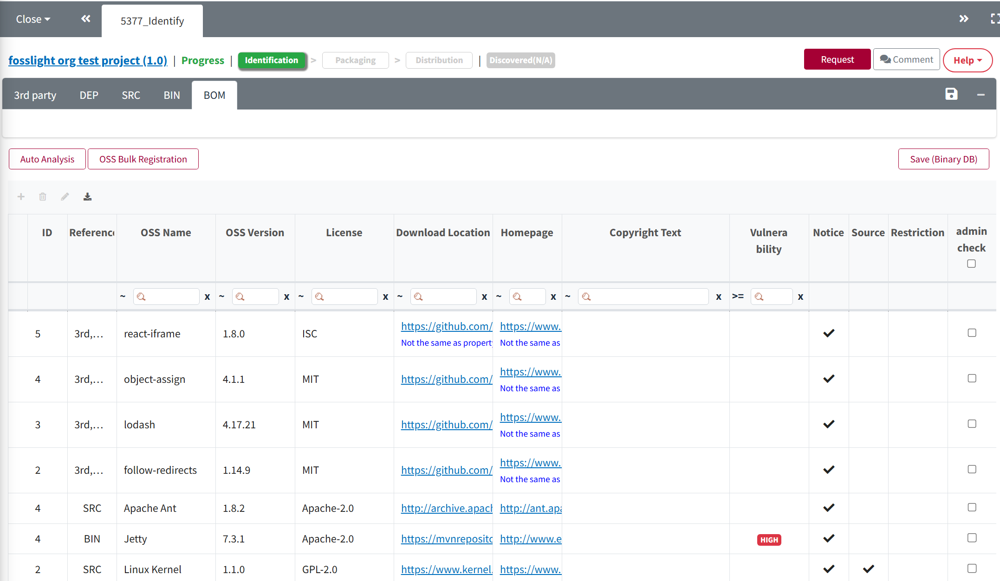

# BOM Tab

Merge the OSS list written in 3rd Party, SRC, and BIN tabs and request to review.  

## How to request a review
{: .left-bar-title }

    <iframe src="https://www.youtube.com/embed/ErqmgN-YgD0" title="BOM 탭(SBOM 다운로드)" frameborder="0" allow="accelerometer; autoplay; clipboard-write; encrypted-media; gyroscope; picture-in-picture" allowfullscreen></iframe>

{: .styled-image}
1. Click the 'Merge And Save' button.
    - Merge the OSS list written in 3rd Party, SRC, BIN tabs.  
2. [**Check Warning message**](https://fosslight.org/hub-guide/tips/1_common/5_warning_message)  
3. Request to review by clicking the 'Request Review' button. 
    - However, if there is a red Warning Message, you cannot request a review.  

### (Admin only) Review Process  
{: .specific-title} 
1. Click the Review Start button in the upper right corner of the BOM tab.  
2. Review the issues highlighted in the [Warning message](https://fosslight.org/hub-guide/tips/1_common/5_warning_message).  
3. After clicking **Save**, click Confirm to activate the Packaging tab.  
    - If a re-confirmation from the Creator is needed, click **Reject** to change the status back to Progress.  

## OSS Table Description
{: .left-bar-title }
Each row's OSS Name and OSS Version is merged from 3rd Party, SRC, BIN.  
However, if the OSS Name is-, it is not merged.
- Reference : Tab where the corresponding OSS Name and OSS Version are written.
- Obligation
    - Notify : Copyright and License Notice Obligations.
    - Source : Source Code Disclosure.
- Restriction: When the **R** icon is displayed, there are restrictions on the license.  
- admin check: The following exceptions apply to admin checked items.  
    - Obligation changed by admin is applied instead of Obligation corresponding to the license of the row.  
    - Licenses not included in OSS Name and OSS Version can also be written.  
    - OSS Name can be written as nickname.  
    - For OSS Name and OSS Version, information written in the relevant row is included in the OSS Notice instead of the copyright text, download location, and homepage information stored in the OSC system.  

## Export
{: .left-bar-title }
You can extract the contents of all tabs through the Export button.  
- When extracting a FOSSLight Report (Spreadsheet), a warning message for each row is additionally displayed.  
- In front of the warning message, it is indicated which column the warning message is written in. ex. (L) This field is required. (ON) Unconfirmed open source.  

| Column Name                     | Column name indicating the warning message |
|----------------------------------|-----------------------|
| OSS Name                         | ON                    |
| OSS version                      | OV                    |
| License                          | L                     |
| Download location                | D                     |
| Homepage                         | H                     |
| Source Name or Path             | S                     |
| Binary Name                      | B                     |
| Source Code Path                 | S                     |
| Binary Name or Source Path       | B                     |