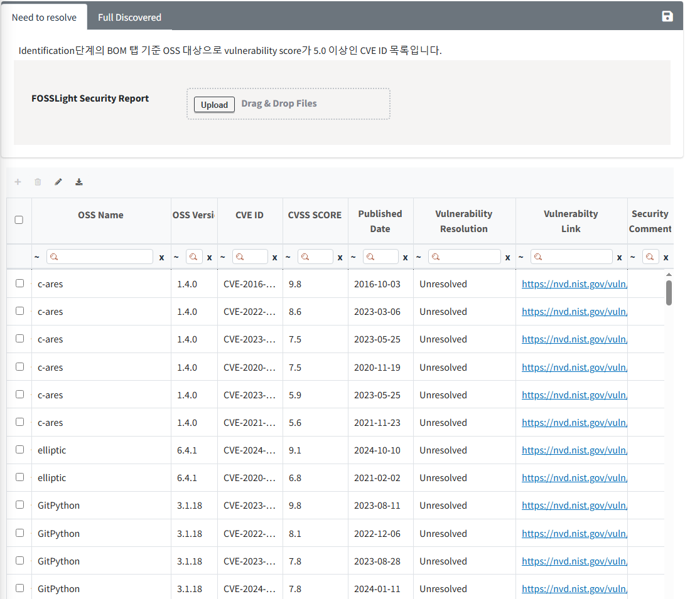
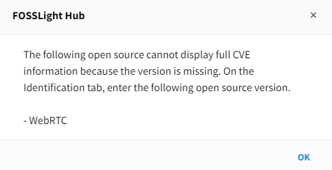
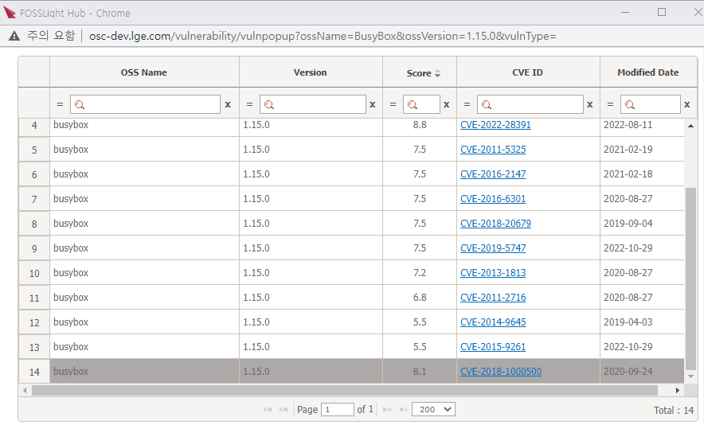

# Security Tab

In the Security tab, you can check and manage the status of actions for each CVE ID for OSS with a vulnerability score above the threshold based on the BOM tab in the Identification stage.  
    • The threshold for the Vulnerability Score can be set in Code Management > 760 (Security Vulnerability Score).   

{: .styled-image}  

## Column
{: .left-bar-title }
- **OSS Name, OSS version**
    - The OSS information entered in the BOM tab of the Identification stage is automatically displayed.
- **CVE ID, CVSS Score, Published Date**
    - The CVE ID and the corresponding CVE ID's CVSS Score and published date information are automatically displayed.
- **Vulnerability Resolution**
    - The default value is set to Unresolved, and it can be changed to Fixed when the security vulnerability is resolved.

### If OSS version is not entered
{: .specific-title}
- In the Security tab, it is difficult to accurately verify vulnerabilities for CVE IDs without an OSS version, so the entire list of CVE IDs is not displayed.  
- If the following popup screen appears when entering the tab, you can view the accurate list of security vulnerability CVE IDs in the Security tab after entering the correct version of the corresponding open source in the Identification tab and saving the BOM tab.  
{: .styled-image}  

### Reflecting Vulnerability Resolution in the Identification Stage
{: .specific-title}
- When checking the vulnerability score in the Identification stage tab, you can see the excluded max score for CVE IDs whose vulnerability resolution value has been changed to ‘Fixed' in the Security tab.  
- When clicking the Vulnerability Icon in the Identification stage tab, you can see that the ‘Fixed' CVE IDs are deactivated in the entire CVE ID list window for the corresponding OSS name and version, as shown below.  
{: .styled-image}  

