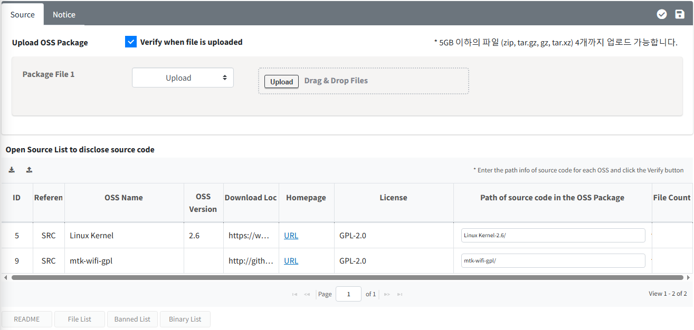
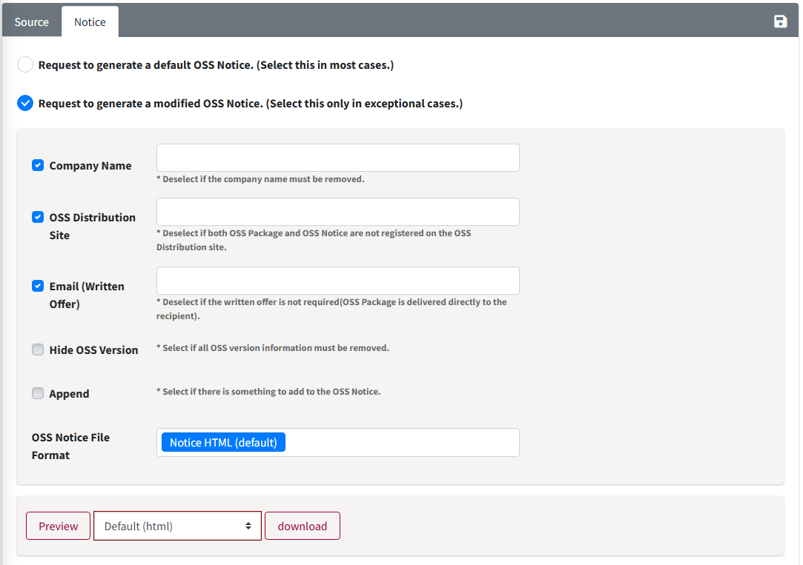
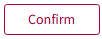

# Packaging

• In the Packaging phase, if you use open source with the obligation to disclose the source code, you must collect the source code to be disclosed (OSS Package) and register it to the OSC System. 
• The OSS Notice will be generated automatically. If you need to change the contents of the OSS Notice, you can modify it in the Notice tab. 
• Click the button in the Packaging column of the Project List to access the menu. 

  

<iframe src="https://www.youtube.com/embed/H4CPBzUOn7M" title="OSS Package & OSS Notice 생성" frameborder="0" allow="accelerometer; autoplay; clipboard-write; encrypted-media; gyroscope; picture-in-picture" allowfullscreen></iframe>

## Packaging tab
{: .left-bar-title }
{: .styled-image}
In the Packaging tab, upload the OSS Package file and verify it.  
(However, this step will not be performed unless you have used open source under terms that require the disclosure of source code such as GPL or LGPL.)  
1. **OSS Package Upload**
    - Upload the Packaging file (compressed file) that consolidates the source code.  
2. **"Path of source code in the OSS Package" column을 기입합니다.**
    - If there are many types of Open Source that need to be disclosed, and it is difficult to fill in each path individually, you can download the Packaging OSS List file by clicking the 'Export Path'() button. After filling in the paths in the downloaded file, you can upload it by clicking the 'Upload Path'() button, and the path information will be registered.  
    - You can save the entered path information with the 'Save' button.  
    - Path information is case-sensitive, so please be careful when entering it.  
3. **'lick the 'Verify' button() to perform the verification process.**
    - After verification, the number of files found in the OSS Package will be displayed in the File Count field. If any Open Source is not found, it will indicate "path not found."  
    - You can review the README, File List, and Banned List found in the OSS Package:  
        - **README**:  The README file included in the OSS Package.
        - **File List**: A list of files in the OSS Package.
        - **Banned List**:  A list of files that should not be disclosed, such as "Proprietary" or  
        - **Binary List** : Binary files included in the OSS package.  

## Notice tab
{: .left-bar-title }
OSS Notice is automatically generated based on the Identification > SBOM tab.  
{: .styled-image}

- Request to generate a default OSS Notice. (Select this in most cases.)
    - You can choose to issue an OSS Notice without any modifications.  
- Request to generate a modified OSS Notice. (Select this only in exceptional cases.)  
    - You can modify the format or contents of the OSS Notice.  
        - Append: Add content to the OSS Notice.
            - Editor: Manually enter the content to be added.
            - File Upload: Upload a file containing the content to be added.
        - The OSS Notice file format can be found at [Types of OSS Notices](../../../tips/2_project/4_oss_notice/).

## Requesting Review
{: .left-bar-title } 
- Click the **Request Review**() button at the top right of the Packaging tab to request a review.  

## Review Process (Admin Only)
{: .left-bar-title } 
- Click the **Review Start**() button at the top right of the Packaging tab. 
- Click the **Bypass**() button at the top right of the Packaging tab to confirm without performing the Packaging.  
- Click **Confirm**() button at the top right to confirm the Packaging, completing the OSC Process.  
- For Projects where Packaging is confirmed, you can download the issued OSS Notice from the Project List.  
    - If re-confirmation is needed from the Creator, click Reject to change the Status back to Progress.  