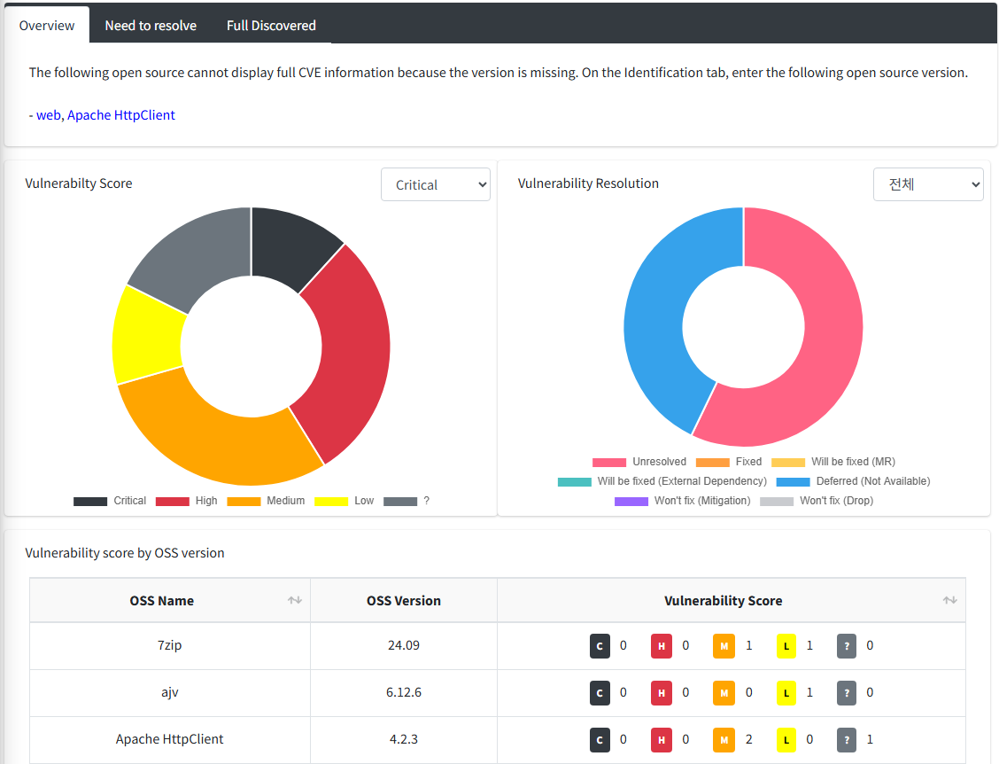
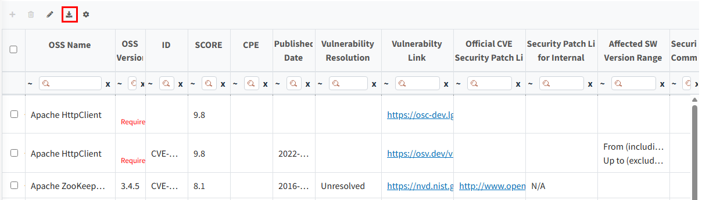
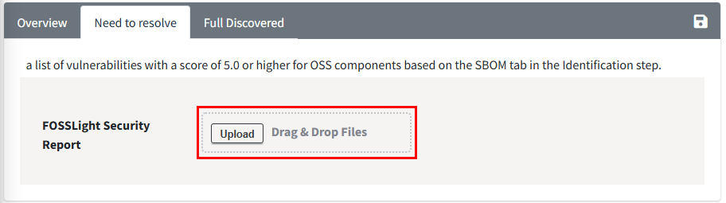
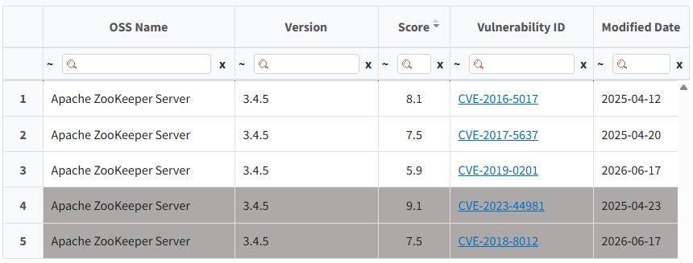

# Security Tab

In the Security tab, you can check and manage the status of actions for each Vulnerability ID for OSS with a vulnerability score above the threshold based on the SBOM tab in the Identification stage.  
    • The threshold for the Vulnerability Score can be set in Code Management > 760 (Security Vulnerability Score).   

## Overview Tab
{: .left-bar-title }
This is the first tab that appears when you enter the Security tab. You can check the statistics and charts of detected vulnerabilities for the OSS collected based on the SBOM tab in the Identification stage.
{: .styled-image}  
- In the Security tab, for OSS without an OSS version entered, it is difficult to accurately verify vulnerabilities, so the vulnerability list for that OSS is not displayed. 
  - After checking the list of OSS without an OSS version entered at the top of the Overview tab, you can enter the OSS Version in the Identification tab and Save in the SBOM tab to view the vulnerabilities for the entered OSS version in the Security tab.

### Vulnerability Score
{: .specific-title}
- You can check the number of vulnerabilities by vulnerability score range for all Vulnerability IDs.
  - Critical : 9.0 <= CVSS <= 10.0
  - High : 7.0 <= CVSS < 9.0
  - Medium : 4.0 <= CVSS < 7.0
  - Low : 0 < CVSS < 4.0
  - ? means that the score does not correspond to a CVSS Score, so it is not included in any range.

### Vulnerability Resolution
{: .specific-title}
- You can check the count by Vulnerability resolution updated in the Need to Resolve tab.

### Vulnerability score by OSS version
{: .specific-title}
- You can check the number of vulnerabilities by vulnerability score range for each OSS version.
- When clicking each Vulnerability Score range, you can check only the vulnerabilities that fall within that score range in the Vulnerability detail popup.

 
## Need to resolve / Full Discovered Tab
{: .left-bar-title }
{: .styled-image}  
- **Need to resolve tab** : You can check the list of all detected vulnerabilities for OSS with a Vulnerability score equal to or higher than the threshold based on the SBOM tab in the Identification stage.
- **Full Discovered tab** : You can check the list of all detected vulnerabilities for all OSS based on the SBOM tab in the Identification stage.

### Column
{: .specific-title}
- **OSS Name, OSS version**
  - The OSS information entered in the SBOM tab of the Identification stage.
- **Vulnerability ID, Score, Published Date**
  - The Vulnerability ID and the corresponding vulnerability's Score and published date information.
- **CPE**
  - The CPE value when matched with the NVD database.
- **Vulnerability Resolution**
  - The processing status for the detected Vulnerability. The default value is set to Unresolved, and the Resolution can be changed according to the security vulnerability action.
- **Vulnerability Link**
  - The site Link value of the NVD or OSV database.
- **Official Security Patch Link**
  - The official Patch Link value provided by the NVD or OSV database.
- **Security Patch Link for internal**
  - If a patch was applied through an internal repository, you can enter the URL value.
  - The initial value is 'N/A' and is not editable. When the Vulnerability Resolution value is changed to 'Fixed', the item is converted to blank and becomes editable.  
- **Affected SW Version Range**
  - The SW version range affected by the vulnerability.

### Export Results
{: .specific-title}
{: .styled-image} 
- Click the Export icon to download the entire table list as an Excel file.

### Bulk Edit
{: .specific-title}
You can modify multiple rows at once using the Bulk Edit function.
1. Check the rows to be modified, then click the Bulk Edit icon in the upper left of the table.
   {: .styled-image} 
2. Select the Attributes to change and modify the Contents, then click the Change button.
   - Security Patch Link for Internal can only be written when the Vulnerability Resolution is 'Fixed'.
    {: width="600px" height="70px" .styled-image } 

### Upload via Excel File
{: .specific-title}
{: width="800px" height="70px" .styled-image } 
- It is recommended to modify the result file exported from the Need to resolve tab and then Upload it for use.
- If a row with the same OSS Name, OSS Version, and Vulnerability ID values in the uploaded Excel file exists in the Security tab, the uploaded Vulnerability Resolution, Security Patch Link for Internal, and Security Comments values will be applied to that row. 
- If the Vulnerability Resolution is not Fixed, the Security Patch Link for Internal value is always set to N/A. 

 
## Reflecting Vulnerability Resolution in the Identification Stage
{: .left-bar-title }
- When checking the vulnerability score in the Identification stage tab, you can see the excluded max score for Vulnerability IDs whose vulnerability resolution value has been changed to 'Fixed' in the Security tab.
- When clicking the Vulnerability Icon in the Identification stage tab, you can see that the 'Fixed' Vulnerability IDs are deactivated in the entire Vulnerability ID list window for the corresponding OSS name and version, as shown below.  
{: .styled-image}

