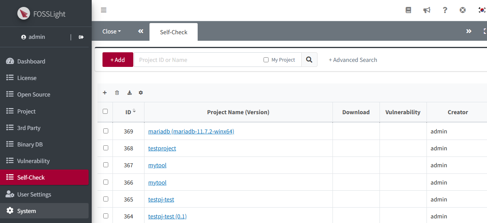
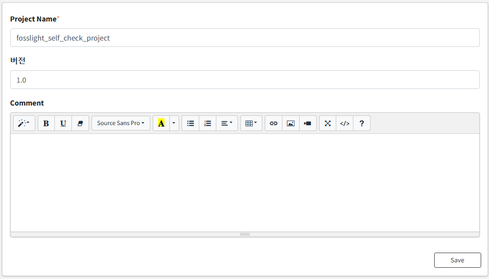
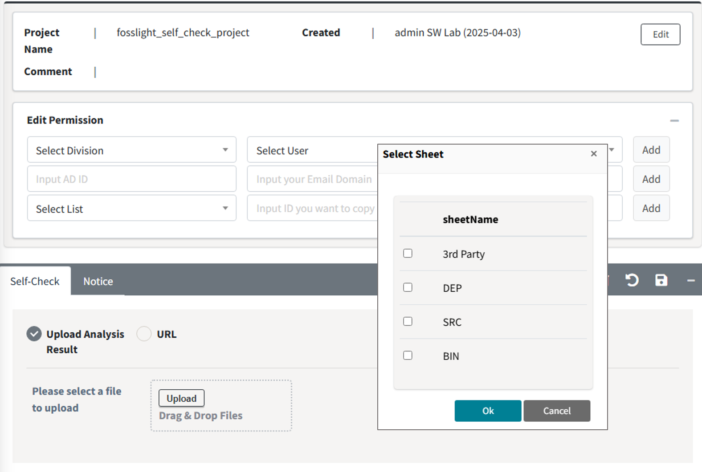
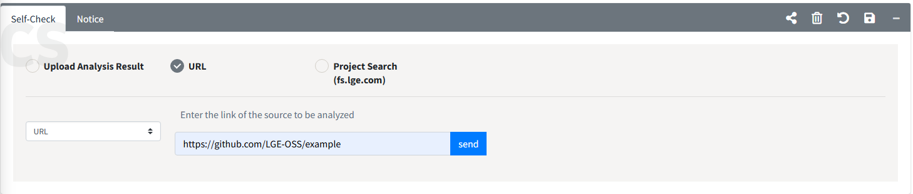
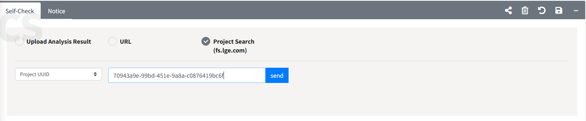

# Create Self-Check Project

You can create a Self-Check project and add OSS list you wish to check one by one using the UI or at once using OSS report.    

## Self-Check Project creation  
{: .left-bar-title }
1. Click the Add button at the top right of the Self-Check List.  
{: .styled-image}    
2. Enter the relevant information and click Save.  
{: .styled-image}  
3. You can view the newly created Self-Check Project in the Self-Check List, and double-click the list to check the details.  

##  OSS information input 
{: .left-bar-title }

### Fill in OSS List in the browser
{: .specific-title}  
1. Click the + button to add a row, fill in the OSS you want to check, and save.
2. Fill in the information (OSS Name, OSS Version, License) in the added row. 
    - When you enter the OSS Name and OSS Version, the information will be retrieved through [**OSS Information Auto-Fill**](https://fosslight.org/hub-guide-en/tips/1_common/1_oss_table/3_autofill_oss_info.html) if it is stored in the FOSSLight Hub.

### Upload Analysis Result 
{: .specific-title}
1. Upload the FOSSLight Report containing the OSS list in the Upload Analysis Result column.  
   Uploadable FOSSLight Report form can be downloaded by clicking the Export button.  
  {: .styled-image}  
2. Select the sheet to be loaded and click OK. 
3. Click the Save button().  

### (Enterprise Only) Loading the FOSSLight Scanner Service analysis results.
{: .specific-title}
**FOSSLight Hub's Self-check is integrated with [FOSSLight Scanner Service](http://fs.lge.com/).**     
Option 1. Select URL and enter the source link to be analyzed (a link that can be downloaded using wget or git clone) and click Send button.  
   {: .styled-image}
Option 2. Load the analysis result Report of the completed Project from [FOSSLight Scanner Service](http://fs.lge.com/).  
   {: .styled-image}
