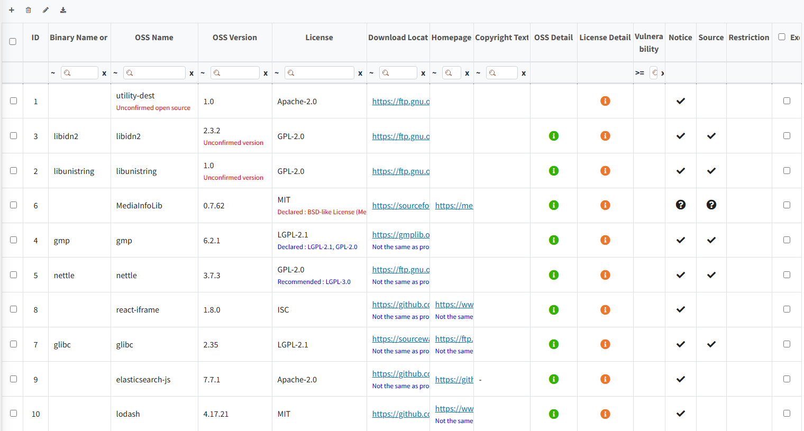
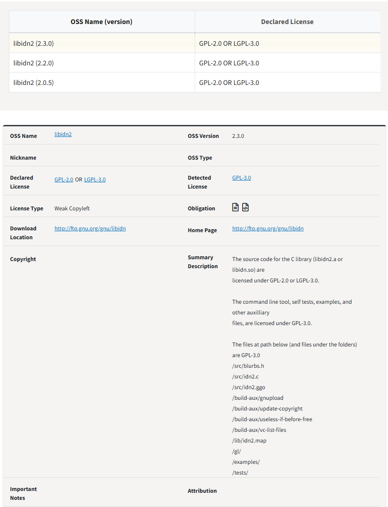
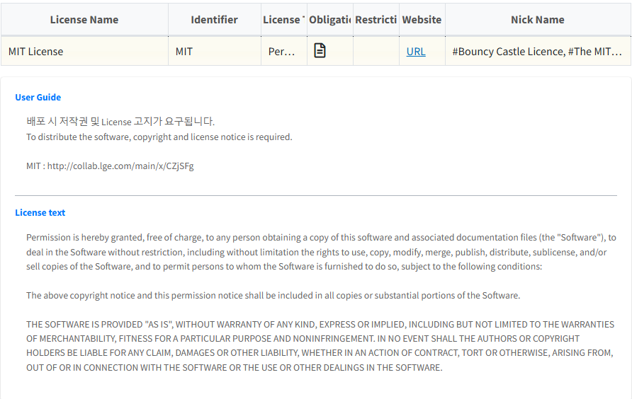

# Check OSS and License information 
{: .styled-image} 

## Warning Messages
{: .left-bar-title }
Described OSS, version and license will be compared with OSS information that are already registered on OSC system and related information will be displayed.   

| Message                 | Meaning |
|-------------------------|-----|
| Unconfirmed open source | Displayed when the OSS Name is not registered in FOSSLight Hub. | 
| Unconfirmed version | Displayed when the OSS Name is registered in FOSSLight Hub, but the same version is not registered. |
| This field is required | Displayed when the License information is not entered.      (This is not a mandatory field in Self-Check.) | 
| Non-included license | Displayed when the OSS Name and OSS Version are registered in FOSSLight Hub, but the registered License is different. |  

## OSS and License information
{: .left-bar-title }
- If there are registered OSS and License information, icons will be displayed in the OSS Detail and License Detail columns.     
- Clicking the icon in the column below provides detailed information about the registered OSS, the License, and a guide for the License. However, even for registered OSS, a User Guide may not always be provided.  
    - **OSS Detail** : Detailed information such as various versions of the registered OSS, each License, and Copyright is provided in a popup window.   
      {: .styled-image}    
    - **License Detail** : Detailed information about the License used by the OSS and the License Text are provided in a popup window.  
      {: .styled-image}   
        - **User Guide** : Links to information that can be referenced when using the License are provided.  

## Obligations/restrictions according to the use of OSS
{: .left-bar-title }
 Details can be checked in the [**License List**](2_license.md).
- **Notice Column**: If the checkmark() is marked, it indicates an obligation to notify regarding copyright, license, or both.  
- **Source Column**: If the checkmark() is marked, it indicates an obligation to disclose the source code.  
- **Question Mark Icon** () in the Notice/Source Column:  
    Obligations cannot be determined for unregistered Open Source/License.
- **Restriction Column** : If the restriction icon () is marked, it indicates there are restrictions on using the OSS.  
(E.g., restrictions on modification, restrictions on commercial use, etc.)  