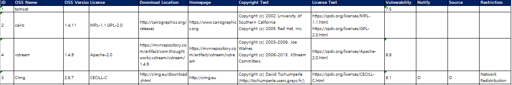

# Check Vulnerability information

 º Icon in the Vulnerability column : When the OSS is searched in the CVE DB provided by NIST, the Vulnerability icon is displayed in color according to the CVSS Score. 
º Vulnerability information in an export file(.xlsx) : An Excel file containing a list of all described OSS and vulnerability information is downloaded. 
º Detailed information related to Vulnerability can be found in <a href="../../menu/7_vulnerability.md">Vulnerability</a>.

## 1. Checking in FOSSLight Hub UI 
{: .left-bar-title }
When you click the Vulnerability icon, the vulnerability information of the corresponding OSS Name and OSS Version is provided in a pop-up window. 
  

## 2. Checking with an export file
{: .left-bar-title }
### 3. Self-Check Sheet
{: .specific-title}  
- The OSS list entered by the user is formatted according to the FOSSLight Report form.   
- The information in this tab can be used later in Identification of [Project](../../menu/4_project.md).   
       

### 2. Vulnerability Sheet
{: .specific-title}  
 
- The entered version and higher version information of the OSS where vulnerability information was found are provided.    
    - OSS Name : OSS Name written in the OSS Table
    - Nick Name : When Vulnerability is searched with the nickname of the OSS written in the OSS table, the matched nickname is displayed. (If no nickname is matched, it is marked as -)
    - OSS Version : Vulnerability searched version
    - Max Score : Vulnerability Max Score for the relevant OSS, Version
    - Vulnerability Link : Displays a pop-up link that allows you to check the list of Vulnerability searched by the OSS Name and OSS Version.