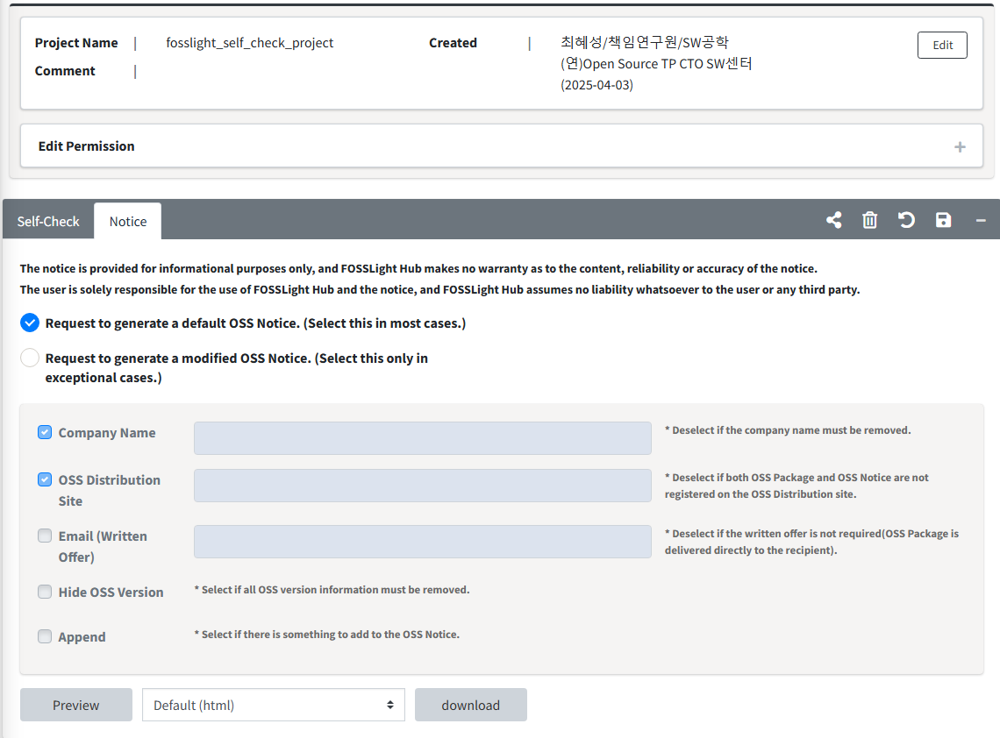

# Self-Check Notice 

You can issue your own OSS Notice using the Notice tab in Self-Check.  

## How to the OSS Notice
{: .left-bar-title }
- The OSS Notice is issued based on the information recorded in the OSS Table within Self-Check, excepting cases where the license is not registered.
  
    - Request to generate a default OSS Notice. (Select this in most cases.)
        - You can choose to issue an OSS Notice without any modifications.  
    - Request to generate a modified OSS Notice. (Select this only in exceptional cases.)
        - You can modify the format or contents of the OSS Notice. 
        - You can append files to the OSS Notice to add more information.  
    -  You can download the OSS Notice with the format you selected by clicking the **download** button.  
